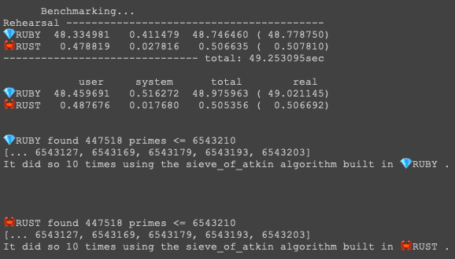
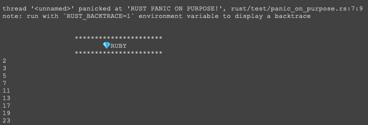

# 🦀rustby🐝

### 💎 Ruby containing Rust 🦀 (thx. to [rutie](https://github.com/danielpclark/rutie))
### [GH Project](https://github.com/users/nathanielBellamy/projects/2)

#### Ruby for Development  ->  Rust for Speed

## intro

- Build in [Ruby](https://www.ruby-lang.org/en/)
  - maintain all functionality in Ruby
- Optimize in [Rust](https://www.rust-lang.org/)
  - translate performance sensitive operations into Rust
  - compare Ruby and Rust performance using [`Benchmarker`](lib/services/benchmarker.rb)
  
    
- Fallback on Ruby
  - worst case, it's Ruby
  - wrap your Rust code in a default Ruby implimentation using [`Fallbacker`](lib/services/fallbacker.rb)
  
    

### to run:

- tour
  - `rake main`
  - `rake primes:demo:benchmark {limit} {count}`
  - `rake primes:demo:fallback {limit} {count}`
- compute primes
  - `rake primes:ruby {limit}`
  - `rake primes:rust {limit}`
- run tests
  - `rake spec:run`
    - runs `rspec` and `cargo test`
    - builds Rust code before running `rspec`

#### Primes

  - 🦀rustby🐝 made use of `Primes` as the example module around which to build
  - it contains two modules to compute primes
    - [`Primes::Alg::SieveOfAtkin`](lib/primes/alg/sieve_of_atkin/mod.rb) and [`Primes::Alg::Naive`](lib/primes/alg/naive/mod.rb)
    - Each module computes primes using a different algorithm
      - each algorithm is provided in both Ruby and Rust via a computational class:
        - [`Primes::Alg::SieveOfAtkin::Ruby`](lib/primes/alg/sieve_of_atkin/ruby.rb)
        - [`Primes::Alg::SieveOfAtkin::Rust`](lib/primes/alg/sieve_of_atkin/rust.rb)
        - [`Primes::Alg::Naive::Ruby`](lib/primes/alg/naive/ruby.rb)
        - [`Primes::Alg::Naive::Rust`](lib/primes/alg/naive/rust.rb)
      - while overkill for computing primes, this demonstrates the nesting pattern:
        - `MyComputationalModule`
          -  `MyComputationalModule::Ruby`
          -  `MyComputationalModule::Rust`
  - args
    - `{limit} - 💎Integer, 🦀u64`
      - compute all primes less than or equal to
      - increase to stress test memory usage
    - `{count} - 💎Integer, 🦀u64`
      - run the computation this many times
      - increase to stress test computation speed
    - `{alg_str} - 💎String`
      - select algorithm for computation
      - can be:
        - `sieve_of_atkin, soa, s`
        - `naive, n`

##### demo 🦀rustby🐝 using primes

- `rake primes:demo:benchmark`
- `rake primes:demo:fallback`

##### compute using 💎ruby

 - `rake primes:ruby {limit} {alg_str}`
 - `rake primes:ruby:sieve_of_atkin {limit}`
 - `rake primes:ruby:naive {limit}`

##### compute using 🦀rust

 - `rake primes:rust {limit} {alg_str}`
 - `rake primes:rust:sieve_of_atkin {limit}`
 - `rake primes:rust:naive {limit}`

##### benchmark performance: 💎ruby vs. 🦀rust

 - `rake primes:benchmark {limit} {count}`
 - `rake primes:benchmark:sieve_of_atkin {limit} {count}`
 - `rake primes:benchmark:naive {limit} {count}`

## License

The gem is available as open source under the terms of the [MIT License](https://opensource.org/licenses/MIT).
